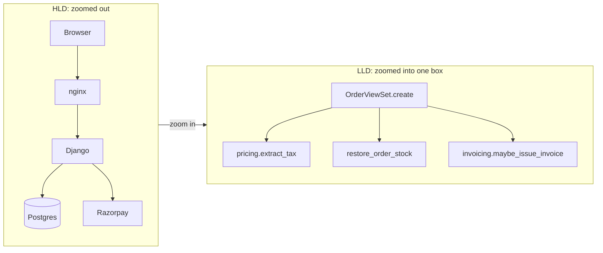
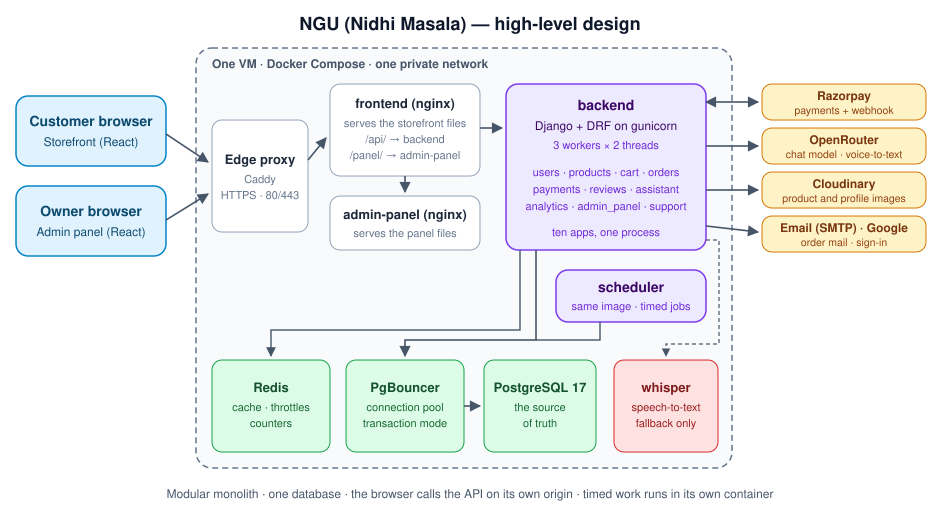
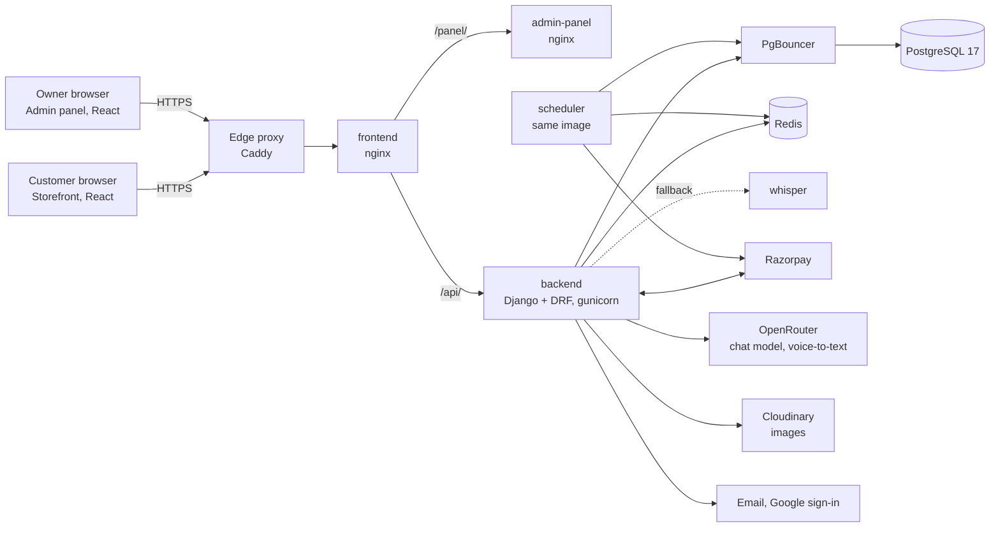
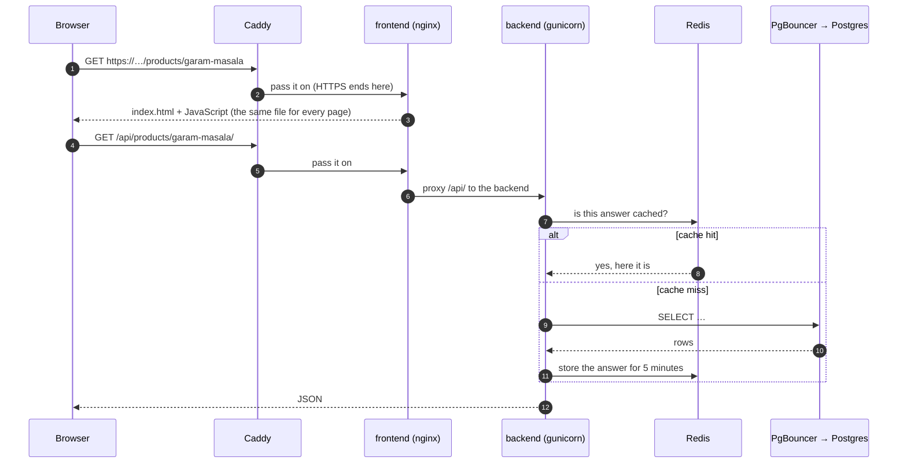
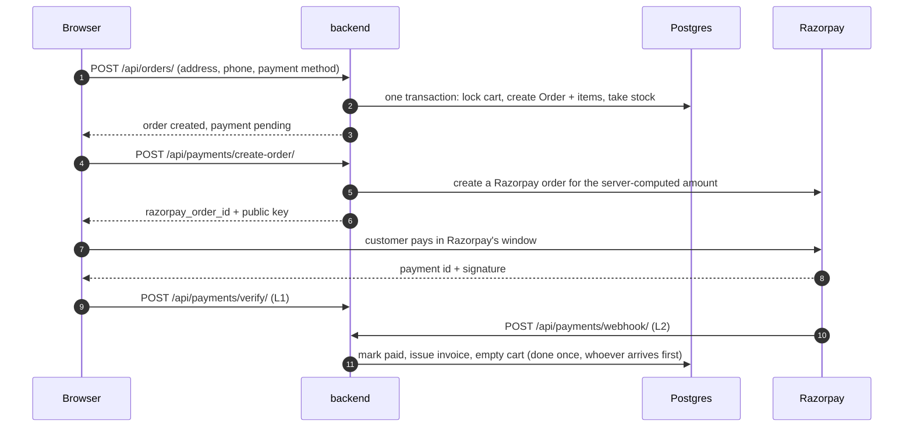
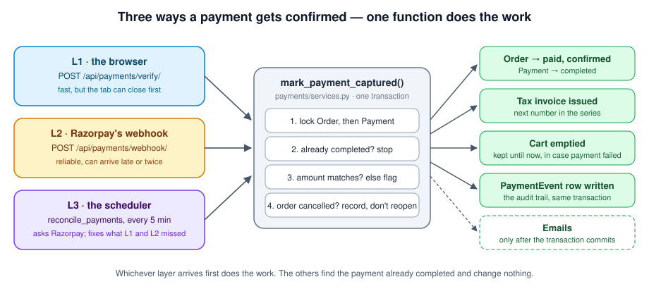
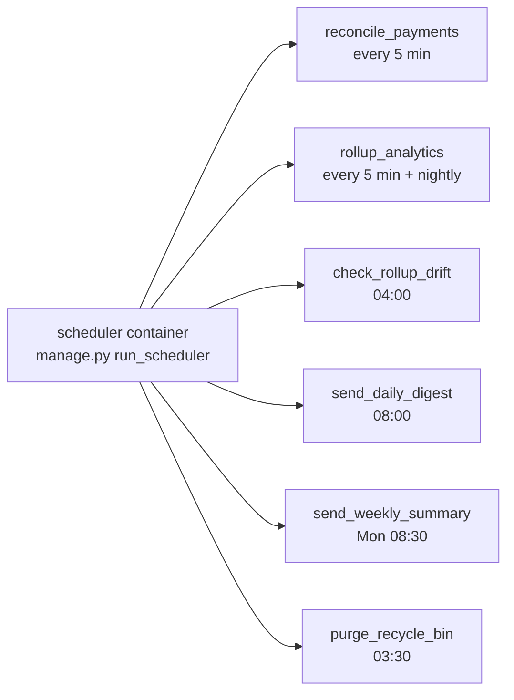
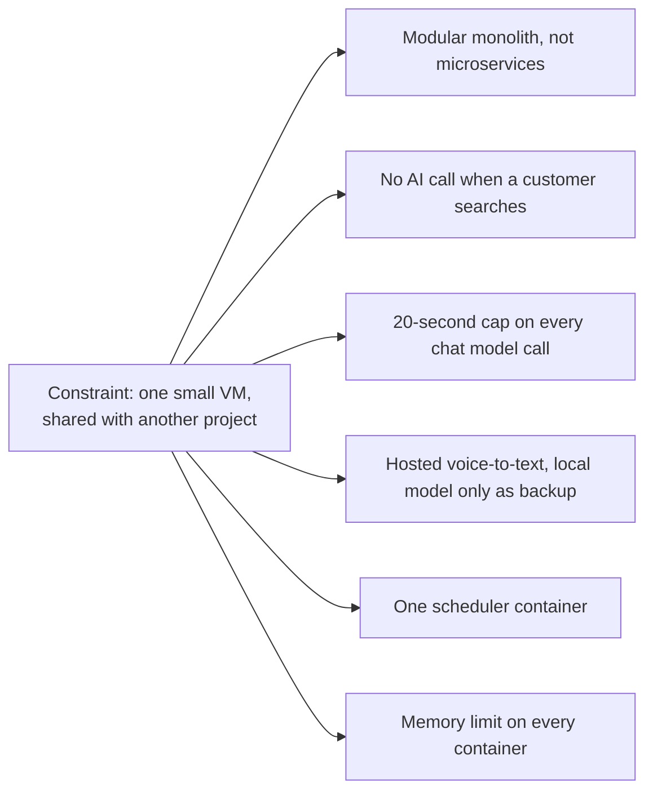
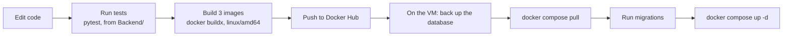

# Part 1 — High-Level Design (HLD)

> What the big boxes are, how a request travels through them, and why each box
> is there. Back to the [index](README.md).

---

## 0. How to use this guide

- **Read one section, then open the file it links to.** The excerpts here are
  short. The real file has the full reasoning in its comments.
- **For each decision, learn three things:** what problem it solves, where it
  lives in this project, and what it costs. Knowing the cost is what shows you
  have used a design and not only read about it.
- **Say the "interview line" out loud.** Each one takes about 20 seconds.
- Paths are relative to this file, so the links open in VS Code and on GitHub.

One rule to keep in mind the whole way through:

> **A design choice is an answer to a constraint.** Say the constraint first
> ("the shop runs on one small VM that another project shares"), then the choice
> ("so background jobs get their own small container with a memory limit").
> Naming the choice first sounds like a textbook.

---

## 1. HLD vs LLD in one page

| | High-level design (HLD) | Low-level design (LLD) |
|---|---|---|
| **Question** | What are the big boxes, and how do they talk? | What is inside one box, and how is it shaped? |
| **Units** | Servers, containers, databases, caches, outside services | Classes, functions, tables, state machines |
| **Decisions** | Where state lives, what runs where, what happens when a box fails | Which class owns what, which rules must always hold, how errors travel |
| **Drawings** | Box-and-arrow diagram, request path | Class diagram, sequence diagram, state diagram |
| **Interview** | "Design an online store" | "Design a cart / an inventory system / a rate limiter" |
| **In NGU** | Browser → Caddy → nginx → Django → PgBouncer → Postgres; Redis; Razorpay | `Order`, `OrderItem`, `Invoice`, `mark_payment_captured`, `restore_order_stock` |

They are not separate jobs. **The HLD sets the constraints; the LLD has to live
inside them.** An example from this project: the HLD says "one small VM, shared
with another project". That single fact explains several LLD choices further
down: every chat request to the AI model has a 20-second timeout so it cannot
hold a web worker for long, the search engine makes no AI call when a customer
searches, and there is one scheduler container so a timed job never runs twice.

---

## 2. What the product is

NGU is the online store of **Nidhi Masala**, an Indian spice brand. It has three
parts that a person can see:

1. **The storefront.** A customer browses spices and combo packs, adds them to a
   cart, pays online (Razorpay) or chooses cash on delivery, and tracks the
   order. There is a chat assistant that can answer questions and suggest
   products, by text or by voice.
2. **The admin panel.** The owner manages products, stock, orders, refunds,
   coupons and reviews, and reads sales and GST reports.
3. **The paperwork.** Every sale produces a numbered tax invoice. Every refund
   produces a credit note. The GST reports are built from those documents.

The third part is easy to miss and it shapes a lot of the design. A shop in
India must be able to show the tax office a continuous series of invoices that
never change after they are issued. Part 2 explains how the code guarantees that.

---

## 3. The boxes

The same picture as a Mermaid diagram:

What each box does, in one line each:

| Box | What it is | Its one job |
|---|---|---|
| **Storefront** | A React app (`Frontend/nidhi-brand-forge`). After it loads it is one page that redraws itself. | Show the shop and send API calls |
| **Admin panel** | A second React app (`Admin Panel/e-commerce-command-center`) | The owner's control room |
| **Edge proxy (Caddy)** | A program that receives every request from the internet | Hold the HTTPS certificate and pass requests inward |
| **frontend (nginx)** | A small web server in a container | Serve the storefront's files; forward `/api/` to the backend and `/panel/` to the admin panel |
| **admin-panel (nginx)** | Another small web server | Serve the admin panel's files |
| **backend** | Django with Django REST Framework, run by gunicorn (3 worker processes, 2 threads each) | Every rule of the business lives here |
| **scheduler** | The same backend image, started with a different command | Run timed jobs: payment checks, sales roll-ups, owner emails |
| **PgBouncer** | A connection pool in front of the database | Let many short requests share a few database connections |
| **PostgreSQL** | The database | The only source of truth |
| **Redis** | An in-memory key-value store | Cache, rate-limit counters, small counters that are saved to the database later |
| **whisper** | A speech-to-text model in a container | Backup for voice input when the hosted service fails |
| **Razorpay** | Payment gateway | Take the customer's money and tell us about it |
| **OpenRouter** | A gateway to AI models | The chat assistant's model, and voice-to-text |
| **Cloudinary** | Image hosting | Store and serve product images |

Two words used above:

- A **reverse proxy** is a server that receives a request and passes it to
  another server behind it. Caddy and nginx both do this here.
- A **container** is a packaged program with everything it needs, run in
  isolation. Docker Compose starts all of these containers from one file,
  [docker-compose.prod.yml](../docker-compose.prod.yml).

---

## 4. One request, step by step

A customer opens a product page. Follow the request:

1. **The page itself is always the same file.** nginx returns `index.html` for
   every path (`try_files $uri $uri/ /index.html`). The React app then reads the
   URL and decides what to draw. This is what "single-page app" means.
2. **The API call goes to the same domain.** The app calls `/api/...`, a
   *relative* address. So it always calls the domain the page came from. That is
   why login cookies work on every domain the shop is served on (see
   [Part 4 §12](04_LLD_Frontend_Patterns.md)).
3. **nginx forwards `/api/` to Django.** Inside Django the request passes
   through the middleware, then the URL router, then one view. That inner path
   is drawn in [Part 3 §0.6](03_LLD_Backend_Patterns.md).
4. **Catalogue reads are cached.** The catalogue is read all the time and
   changed rarely, so the answer is kept in Redis for a few minutes and thrown
   away when a product is saved ([Part 3 §7](03_LLD_Backend_Patterns.md)).

**Interview line:** "Every request enters through one proxy that holds the
certificate. nginx serves the static app and forwards `/api/` to Django. The
browser only ever calls a relative `/api`, so cookies stay same-origin on every
domain we serve."

---

## 5. Where each kind of state lives

"State" means data that has to be remembered. The first HLD question for any
system is: where does each kind live, and what happens if that place is lost?

| State | Lives in | If it is lost |
|---|---|---|
| Users, products, stock, orders, payments, invoices | **PostgreSQL** | The business is gone. This is the one thing that must be backed up. |
| Cached catalogue answers | **Redis** | Nothing. The next request rebuilds them from Postgres. |
| Rate-limit counters, abuse "strikes", banned IPs | **Redis** | Counters restart at zero. Bans are forgotten. |
| Anonymous visit counters | **Redis**, copied to Postgres every 5 minutes | At most 5 minutes of counts |
| Product and profile images | **Cloudinary** | Pictures break. The database rows still exist. |
| Delivery bills the owner uploads | A private folder on the VM (`private_media_data` volume) | Those scans are gone |
| Login session | Two HttpOnly cookies in the **browser** (a 15-minute access token, a 7-day refresh token) | The customer logs in again |
| Cart of a logged-in customer | **PostgreSQL** (`Cart`, `CartItem`) | — |
| Language choice | The browser's `localStorage` | The site falls back to English |

Three things to notice:

- **Only one box holds truth.** Redis can be emptied at any time and the shop
  keeps working. That is deliberate: a cache that you cannot throw away has
  become a second database.
- **The web containers hold no state.** The backend container can be deleted
  and started again and nothing is lost. This is what makes a deploy safe.
- **Backups today are on the same disk as the database.** A nightly `pg_dump`
  protects against a bad migration or a dropped table. It does not protect
  against losing the VM. Copying the dumps off the machine is the open gap
  (see [CLAUDE.md](../CLAUDE.md), "Database backups").

**Interview line:** "Postgres is the only source of truth. Redis holds only
things I can lose: cache, counters, rate limits. The app containers are
stateless, so a deploy is just replacing a container."

---

## 6. The three flows to know by heart

### 6.1 Buying something

The important design point: **the browser never sends a price.** It sends an
address and a payment method. The server reads the cart from its own database,
computes every rupee, and asks Razorpay for that amount. A customer who edits
the JavaScript cannot change what they pay. Part 2 §4 walks through this flow
line by line.

### 6.2 Making sure a payment is never lost

Money can be confirmed by three different callers, and all three call the same
function, `mark_payment_captured` in
[payments/services.py](../Backend/payments/services.py):

| Layer | Who calls | Why it exists | Its weakness |
|---|---|---|---|
| **L1** | The customer's browser, right after paying | The customer sees "paid" in a second | The tab can close before the call is sent |
| **L2** | Razorpay's server (a **webhook**: a request an outside service sends to us) | Arrives even if the browser is gone | Can be late, and can be sent more than once |
| **L3** | Our scheduler, every 5 minutes | Asks Razorpay directly about any order still unpaid after 15 minutes | Slow: minutes, not seconds |

Because all three run the same function, and that function checks "is this
payment already completed?" before doing anything, the second and third callers
change nothing. A function that can safely run many times is called
**idempotent**. If none of the three finds a captured payment, L3 cancels the
order and puts its stock back on the shelf.

**Interview line:** "I don't trust any single signal that money arrived. The
browser, the webhook and a timed reconciler all call one idempotent function, so
whichever arrives first wins and the rest do nothing."

### 6.3 Timed work

All of these are ordinary Django commands. The scheduler
([run_scheduler.py](../Backend/payments/management/commands/run_scheduler.py))
only decides *when* to call them. Two design points:

- **It is its own container, not a thread inside the web server.** gunicorn
  runs 3 worker processes. A timer inside the web server would exist 3 times and
  every job would run 3 times. One scheduler process means one run.
- **One failing job does not stop the others.** Each job is called inside a
  `try/except` that logs the error and carries on.

**Interview line:** "Timed jobs run in one dedicated process so they can't
double-fire across web workers, and each job is a plain management command that
a person can also run by hand."

---

## 7. HLD decisions worth defending

| Decision | Why | What it costs |
|---|---|---|
| **Modular monolith.** Ten Django apps in one process, one database | One deploy. One transaction can cover an order, its stock and its coupon. No network calls between modules. | Nothing stops the apps from tangling, and some have: `orders` and `payments` import each other, and avoid a circular import by importing inside the function that needs it. Only `users` and `support` depend on no other app. |
| **Everything on one VM with Docker Compose** | Cheap and simple. One file describes the whole system. | One machine is one point of failure. No automatic failover. |
| **Two static React apps behind nginx** | Static files are cheap to serve and can be cached. The API is the only thing that can break. | Search engines see less (handled with a sitemap from the backend). Config is baked at build time (handled with a runtime `config.js`). |
| **Same-origin API (`/api`, relative)** | Cookies are sent without cross-site rules. The same image works on every domain. | The storefront nginx must proxy the API, so it is in the request path. |
| **Login token in an HttpOnly cookie**, not in `localStorage` | JavaScript cannot read it, so a script injected into the page cannot steal it | Cookies are sent automatically, so CSRF protection is needed |
| **PgBouncer in transaction mode** | gunicorn threads share a small number of real database connections | Features that need one connection for a long time (session-level locks, server-side cursors) are not available |
| **Redis for cache and counters only** | Fast reads for a read-heavy catalogue; rate limits work across all workers | One more box. Cache invalidation must be right. |
| **Search without AI at query time** | The AI writes synonyms *once per product*, offline. Searching is then plain fuzzy matching over a cached word list. Fast, free per search, works if the AI provider is down. | New slang needs the synonyms to be regenerated |
| **The assistant only proposes; it never acts** | The model can read through tools. Anything that changes the cart comes back as a proposal the customer must confirm. A confused or tricked model cannot spend money. | One extra tap for the customer |
| **Voice-to-text by a hosted model, local whisper as fallback** | The local model took about 20 seconds per second of audio on this machine; the hosted one about 1 second per sentence | A small cost per minute of audio, and a dependency on an outside service |
| **Images on Cloudinary** | Resizing and delivery are someone else's problem; the VM's disk stays small | The backend will not start without Cloudinary keys |
| **Invoices are stored documents** | A tax invoice must not change after it is issued and its number must be continuous | An extra table and a counter; the invoice is written at a business event, not on demand |

**Interview line (HLD):** "It's a modular monolith on one small VM. So most of
the design effort is about staying inside that box: no model call on the search
path, a hard timeout on every model call, a memory limit on every container,
and one scheduler so timed work runs exactly once."

---

## 8. Numbers to know

These are in the repository, so you can check each one.

| What | Value | Where |
|---|---|---|
| Web server | gunicorn, 3 workers × 2 threads = 6 requests at once | [Backend/Dockerfile](../Backend/Dockerfile) |
| Memory limits | backend 512 MB · scheduler 256 MB · Postgres 420 MB · Redis 300 MB · whisper 1 GB · frontend 128 MB · admin 64 MB · PgBouncer 64 MB | [docker-compose.prod.yml](../docker-compose.prod.yml) |
| PgBouncer | up to 200 client connections share a pool of 25 | same file |
| Redis | 256 MB, evicts only keys that have an expiry | same file |
| Login tokens | access 15 minutes, refresh 7 days, refresh tokens rotate | [settings.py](../Backend/spices_backend/settings.py) |
| Cache lifetimes | 1 min / 5 min / 15 min | same file |
| Rate limits | login 5/min · register 3/min · chat 10/min and 100/day | same file |
| Page size | 12 rows per page | same file |
| Unpaid online order | cancelled and restocked after 15 minutes | `PAYMENT_STUCK_TTL_MINUTES` |
| Reconcile and roll-up cadence | every 5 minutes | `RECONCILE_INTERVAL_MINUTES`, `ROLLUP_INTERVAL_MINUTES` |
| Assistant | at most 4 model rounds per message; 20 s timeout per call | [assistant/agent.py](../Backend/assistant/agent.py) |
| Cash on delivery | at most ₹5,000 per order, at most 3 open COD orders per account | [limits.py](../Backend/spices_backend/limits.py) |
| Languages for product text | English, Hindi, Hinglish, Gujarati, Marathi, Punjabi | settings |
| Backend tests | about 1,280 | `cd Backend && pytest` |

The production VM is a 2-vCPU, 4 GB machine shared with a second project. The
current server details are in [CLAUDE.md](../CLAUDE.md).

---

## 9. What happens when a box fails

A good HLD answer always includes failure. For each box: what breaks, and what
keeps working?

| What fails | What the customer sees | Why |
|---|---|---|
| **The chat model (OpenRouter)** | A polite "I can't answer right now" reply. Shopping works. | The agent catches the error and returns a fallback. It does not flag a human, because nothing is wrong with the customer. |
| **Hosted voice-to-text** | Voice still works, slower | `stt.transcribe` retries on the local whisper container |
| **Razorpay's webhook is missed** | Nothing | L1 usually confirmed already; L3 picks it up within minutes |
| **The browser closes during payment** | The order shows as paid a little later | L2 or L3 confirms it |
| **The customer abandons payment** | Their cart is still full; the stock goes back after 15 minutes | An online order keeps the cart until the payment is captured |
| **The ban check hits a Redis error** | Nothing | `AbuseGuardMiddleware` **fails open**: on any error it lets the request through |
| **The webhook secret is missing** | Payments still work through L1 and L3 | The webhook **fails closed**: with no secret, every webhook is rejected |
| **Postgres** | The shop is down | It is the single source of truth |
| **The VM** | The shop is down | One machine, no failover. This is the accepted cost of the design. |

The two middle rows are the same instinct with opposite answers. Blocking a
real shopper because the cache had a hiccup loses a sale, so that check fails
open. Accepting a fake "this order is paid" message would give away goods, so
that check fails closed. **You pick the direction by asking which mistake is
cheaper.**

---

## 10. How a change reaches production

Things that have gone wrong here, or nearly did, each written up as a lesson:

- A shell script saved with Windows line endings made a container exit at
  start → [lessons/03](lessons/03_the_crlf_entrypoint_outage.md).
- A setting changed meaning between two versions →
  [lessons/01](lessons/01_when_a_config_value_changes_meaning.md).
- A number baked into the frontend image disagreed with the backend →
  [lessons/02](lessons/02_build_time_vs_runtime_config.md).
- A safety check at start-up can take the whole API down →
  [lessons/04](lessons/04_a_boot_guard_and_the_whole_api.md).

The exact commands are in [CLAUDE.md](../CLAUDE.md) and
[DEPLOYMENT.md](../DEPLOYMENT.md).

---

## 11. "What would you change at 10× the traffic?"

This is the standard follow-up. Answer in the order things would actually break.

1. **Back up off the machine first.** Not a scaling step, but the biggest risk
   today.
2. **More web capacity.** Six requests at once is the ceiling. Add workers, or
   run a second backend container behind nginx. This is easy *because* the
   backend holds no state.
3. **Move slow work off the request.** Emails and AI synonym generation now run
   in background threads inside the web process. At higher volume they belong
   in a task queue with a worker (Celery or similar), so a restart does not
   lose them.
4. **Move the database to a managed service** with automatic backups and a
   standby copy.
5. **Put a CDN in front of the static files.** The images are already on one.
6. **Only then** think about splitting a service out. The first candidate is the
   assistant: it is slow, it depends on an outside service, and nothing else
   depends on it.

**Interview line:** "I'd scale the boring parts first: backups, more stateless
web workers, a real task queue, a managed database. Splitting services comes
last, and the assistant would be first because it is slow and isolated."

---

Next: [Part 2 — the object model and the main flows](02_LLD_Object_Model_and_Flows.md).
