# Part 2 — LLD: the Object Model and the Main Flows

> The classes that carry the design, why each is shaped the way it is, and how
> the important flows run through them step by step.
> Back to the [index](README.md). Previous: [Part 1 — HLD](01_HLD.md).

This part is about *this* project's objects. The general patterns (ViewSet,
Serializer, signals, caching) are in [Part 3](03_LLD_Backend_Patterns.md). If a
Python or Django word here is new, Part 3 explains it the first time it appears.

---

## 1. The map

Each box is a Django **model**: a Python class that is also a database table.
An arrow means "has a link to".

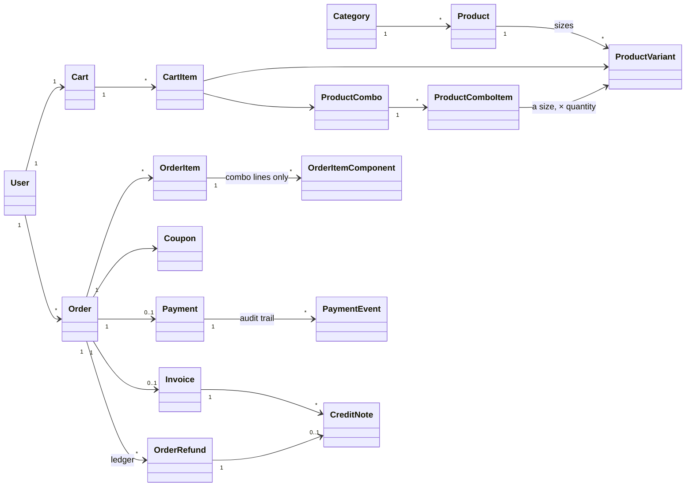

Read it in four groups:

| Group | Models | Changes how often | File |
|---|---|---|---|
| **Catalogue** | `Category`, `Product`, `ProductVariant`, `ProductCombo`, `ProductComboItem` | Rarely, by the owner | [products/models.py](../Backend/products/models.py) |
| **Intent** | `Cart`, `CartItem`, `Favorite` | All the time, by customers | [cart/models.py](../Backend/cart/models.py) |
| **Commitment** | `Order`, `OrderItem`, `OrderItemComponent`, `Payment` | Once, then only status moves | [orders/models.py](../Backend/orders/models.py), [payments/models.py](../Backend/payments/models.py) |
| **Documents** | `Invoice`, `CreditNote`, `OrderRefund`, `PaymentEvent` | Written once, never edited | same files |

The groups go from "anyone can change it" to "nobody can change it". That
gradient is the most useful idea in this part: **the closer a row is to money
or tax, the less it is allowed to change.**

---

## 2. The catalogue

### 2.1 A product is sold by size

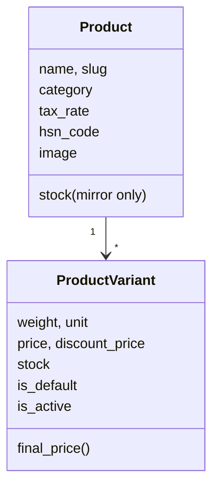

"Garam Masala" is a `Product`. "Garam Masala 100 g" and "Garam Masala 500 g" are
two `ProductVariant` rows. The **variant is the thing that is actually sold**:
it has the price and it has the stock.

Why it is shaped like this:

- **Price and stock belong to the size.** 100 g and 500 g have different prices
  and run out separately. Putting them on `Product` would force one price.
- **Tax rate and HSN code belong to the product.** GST depends on what the good
  *is*, not on how big the pack is. (An HSN code is the tax office's
  classification number for a kind of good.)
- **`Product.stock` still exists but nothing sells from it.** It is an old field
  kept as a mirror of the default variant so older screens keep working. Order
  code says so in a comment: "The legacy Product.stock is only a mirror of the
  default variant".
- **The database enforces two rules** on `ProductVariant`: stock can never go
  below zero (`variant_stock_non_negative`), and a product has exactly one
  default variant (`one_default_variant_per_product`). These are constraints in
  Postgres, so no code path can break them, not even a manual SQL update.

### 2.2 A combo has no price of its own

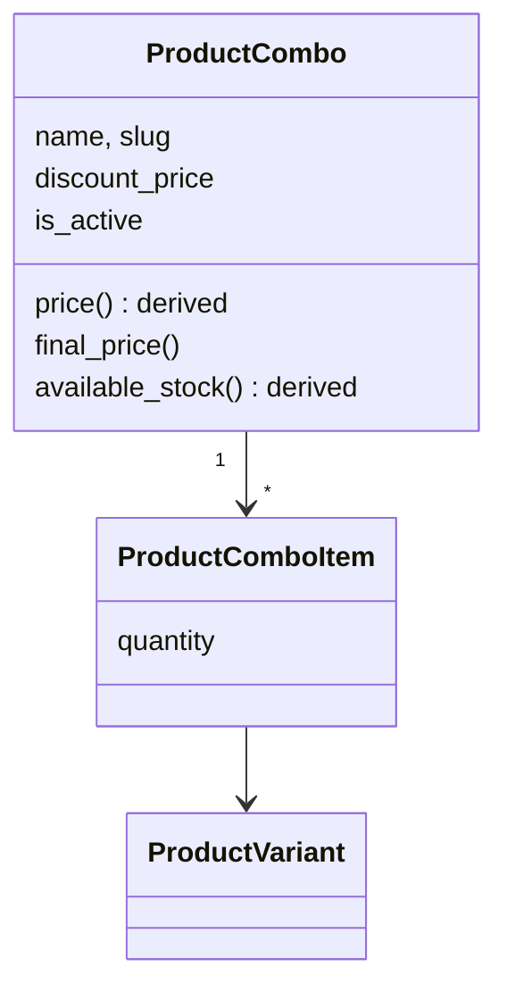

A combo is a box of several sizes sold together. Look at what it does **not**
have: a `price` column, a `stock` column, a `tax_rate` column.

- **`price` is computed**, not stored. It is the sum of what the components
  cost bought one by one (`total_original_price`). If the owner changes the
  price of one spice, the combo's list price follows by itself. A stored number
  would silently go out of date.
- **`available_stock` is computed.** It is how many boxes can still be built:
  for each component, `stock // quantity needed`, then the smallest of those.
  If any component is inactive, the answer is 0.
- **There is no combo tax rate.** A box can mix a 0% item with a 5% item. So
  tax is charged per component (see §5.3).
- The only thing the owner types is `discount_price`: what the box sells for.

**Interview line:** "I store facts and compute conclusions. A combo's list
price and stock are conclusions from its components, so they are properties,
not columns. A stored copy is just a second place to be wrong."

---

## 3. The cart

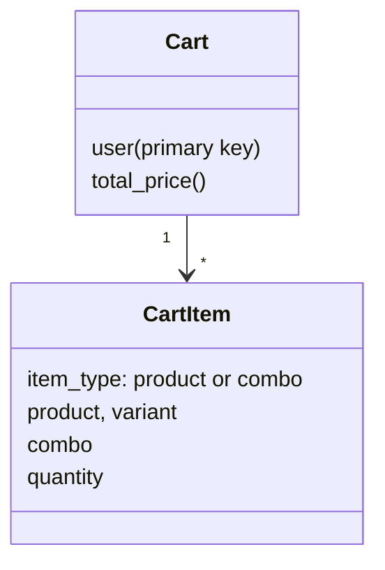

- **One cart per user, and the user *is* the primary key.** `Cart.user` is a
  one-to-one link marked `primary_key=True`. A user cannot have two carts
  because the table cannot hold two rows with the same key.
- **A line is either a product or a combo.** Four database constraints make
  that true:

| Constraint | Rule |
|---|---|
| `valid_item_type_reference` | A `product` line has a product and no combo. A `combo` line has a combo and no product. |
| `unique_cart_variant` | The same size appears on at most one line of a cart |
| `unique_cart_combo` | The same combo appears on at most one line of a cart |
| `positive_quantity` | Quantity is at least 1 |

The second rule is why "add to cart" twice gives one line with quantity 2, and
not two lines. The identity of a line is the *variant*, not the product: 100 g
and 500 g of the same spice are two different lines.

**The cart is a wish, not a promise.** Nothing is reserved while an item sits
in a cart. Stock is taken only when an order is created. That is why checkout
has to check stock again, under a lock (§4).

---

## 4. Checkout, line by line

This is the most important function in the project:
`OrderViewSet.create` in [orders/views.py](../Backend/orders/views.py). Open it
beside this section.

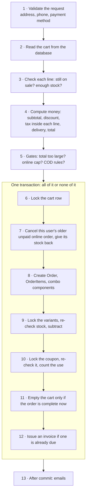

### Why each step is there

**Steps 1–2: the client sends almost nothing.** The request carries an address,
a phone number, a payment method and maybe a coupon code. It carries **no
prices and no items**. The server reads the items from the `Cart` table and the
prices from the `ProductVariant` table. There is nothing a customer can edit in
their browser to pay less.

**Step 3: check before the transaction, then again inside it.** The first
check gives a clean error early ("Insufficient stock for X"). It is not
trusted, because another customer may buy the last unit a moment later. The
real check is step 9.

**Step 4: money is computed once.** Each line's discount and tax are worked out
here and kept. The same numbers are then written to `OrderItem` rows and to the
`Order` header, so the lines always add up to the header (§5).

**Step 5: gates.** Three refusals, each with a reason:

| Gate | Rule | Why |
|---|---|---|
| Size | Total above `MAX_ORDER_TOTAL` | The money columns hold 10 digits. Refuse with a clear message instead of a database error. |
| Online cap | An online order above ₹1,00,000 | UPI has a per-payment limit |
| Cash on delivery | Email must be verified; at most ₹5,000; at most 3 unfinished COD orders | A COD order takes stock off the shelf with no money paid. Throwaway accounts could empty the shop. |

**Step 6: lock the cart row first.** `select_for_update()` asks Postgres to
lock that row until the transaction ends. If a customer double-clicks "Place
order", two requests arrive together. The second one waits here. When it gets
the lock it looks at the cart again.

**Step 7: one unpaid online order per customer.** An online order keeps the
cart until it is paid (step 11). So a customer who gave up on a payment can
check out again. Their older unpaid order is still holding stock, so it is
cancelled and its stock is returned *before* the new order takes stock.

**Step 9: take stock under a lock.** The variants are locked, the stock is read
again from the locked rows, and only then subtracted. Two customers buying the
last unit cannot both succeed: one waits, then sees stock 0 and gets an error.
All the updates go to the database in one `bulk_update`, not one query per line.

**Step 10: count the coupon under a lock.** Same idea. A coupon with "100 uses"
is checked again on the locked row, so two checkouts cannot both take use
number 100.

**Step 11: when is the cart emptied?**

| Order | Cart emptied | Why |
|---|---|---|
| Cash on delivery | Now, in this transaction | The order is complete |
| Fully paid by a coupon (total ₹0) | Now | The order is complete and already "paid" |
| Online | Later, when the payment is captured | If the payment fails, the customer still has their cart |

**Step 13: emails after the commit.** `transaction.on_commit(...)` runs a
function only if the transaction really saved. An email cannot be unsent, so it
must never be sent for an order that was rolled back.

**What `ValueError` means inside the transaction.** Any failed check inside the
block raises `ValueError`. Raising an error makes `transaction.atomic()` undo
everything: no order, no stock change, no coupon use. The customer sees one
clean error message.

**Interview line:** "Checkout never trusts the client for prices or items. It
locks the cart to stop double submits, re-checks stock and the coupon on locked
rows, writes the order and takes the stock in one transaction, and sends emails
only after the commit."

---

## 5. Money rules

All of this is in [orders/pricing.py](../Backend/orders/pricing.py). Money is
always a `Decimal`, never a `float` (floats cannot store 0.1 exactly).

### 5.1 Goods: the price already contains the tax

In India the price on the shelf (MRP) includes GST. So tax is never *added* to
a product price. It is *taken out* of it, to show on the bill:

```
tax = gross × rate / (100 + rate)
```

A ₹210 pack at 5%: `210 × 5 / 105 = ₹10.00` tax, so the price before tax was
₹200. The function is `extract_tax`.

### 5.2 Delivery: the tax is added on top

The delivery fee is the opposite. It is quoted without tax and taxed at 18%:

```
tax = net × rate / 100          →  ₹59 × 18 / 100 = ₹10.62, so the customer pays ₹69.62
```

The function is `add_tax`. Two opposite rules live side by side, on purpose:

| | Goods | Delivery |
|---|---|---|
| The number the customer knows | The shelf price | — |
| GST | Inside the price | Added on top |
| Function | `extract_tax` | `add_tax` |
| Stored in | `Order.tax` | `Order.shipping_tax` |
| Rate | 0% or 5% | 18% |

`Order.total_tax` is a property that adds the two. Every report must use
`total_tax`. Using `tax` alone leaves out the GST on every delivery fee.

So the total is:

```
total = (subtotal − discount) + shipping_charge + shipping_tax
```

Notice goods tax is **not** in that sum. It is already inside the subtotal.
Adding it would charge it twice.

### 5.3 A coupon discount is shared across the lines

A ₹100 coupon on a two-line order is split by each line's share of the
subtotal. Tax is then taken out of each line's *discounted* amount, at that
line's own rate. This matters when one line is 0% and another is 5%.

For a combo line there is one more step, `allocate_combo_components`: the
amount charged for the box is split across the sizes inside it, by each size's
share of the list price, and tax is taken out of each share at that product's
rate. The rounding leftover (a paisa or two) is given to the largest component
so the parts always add up exactly to the line. One `OrderItemComponent` row is
written per component.

### 5.4 Snapshots

An `OrderItem` copies the product name, the size label, the price, the tax
rate and the HSN code **at the moment of the order**. It also keeps a link to
the product, but the bill never reads through that link.

Why: next month the owner may rename the product, change its price or move it
to another tax rate. Last month's order must still show what was actually
charged. A copy made at the time is called a **snapshot**.

`on_delete=PROTECT` on those links adds a second guarantee: a product that
appears on any order cannot be deleted from the database.

**Interview line:** "Prices include tax, so I extract GST instead of adding it,
except delivery which is quoted net. Every order line snapshots the name, price,
rate and HSN code, so re-pricing the catalogue can never rewrite an old bill."

---

## 6. Two state machines on one order

An `Order` has two status fields. They answer different questions.

**`status`: where are the goods?**

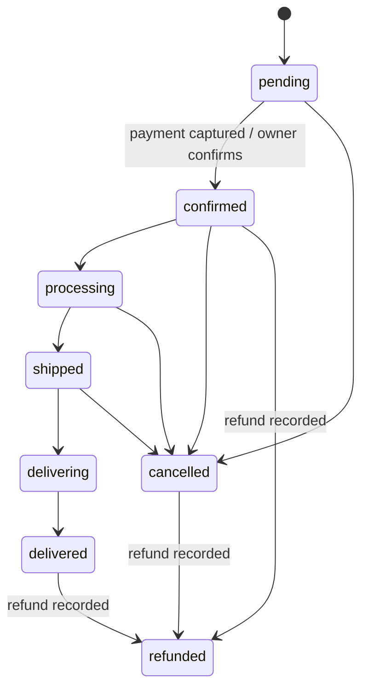

**`payment_status`: where is the money?**

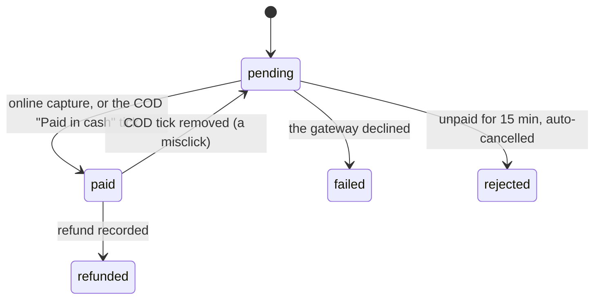

Rules that the code enforces:

- **A customer may only cancel their own order**, and not once it is
  `delivering`, `delivered`, `cancelled` or `refunded`. A customer cannot
  cancel an order whose online payment was captured; they are told to contact
  support, because cancelling would return the stock and keep their money.
- **Only staff may edit an order**, and only a fixed list of fields
  (`ADMIN_EDITABLE_FIELDS`). Money and items cannot be edited through the API
  at all.
- **A refund can only be recorded if money really arrived**
  (`_is_refundable_payment`): an online order that was paid, or a COD order
  where the owner ticked "Paid in cash". A refund reverses tax, so recording
  one for money that never arrived would understate the tax owed.
- **"Paid in cash" is not automatic on delivery.** The courier hands over the
  cash days later. Marking it at delivery would record money that is not there.
- **`refunded` means "a refund was recorded", not "all of it came back".**
  A refund can be partial. Anything that shows the flag must also show
  `refunded_amount`.

The honest note: `status` transitions are not checked against a strict table.
Staff can move an order to any valid status, with a few specific refusals. The
diagram shows the normal path, not a rule the code enforces for every arrow.

---

## 7. Payments

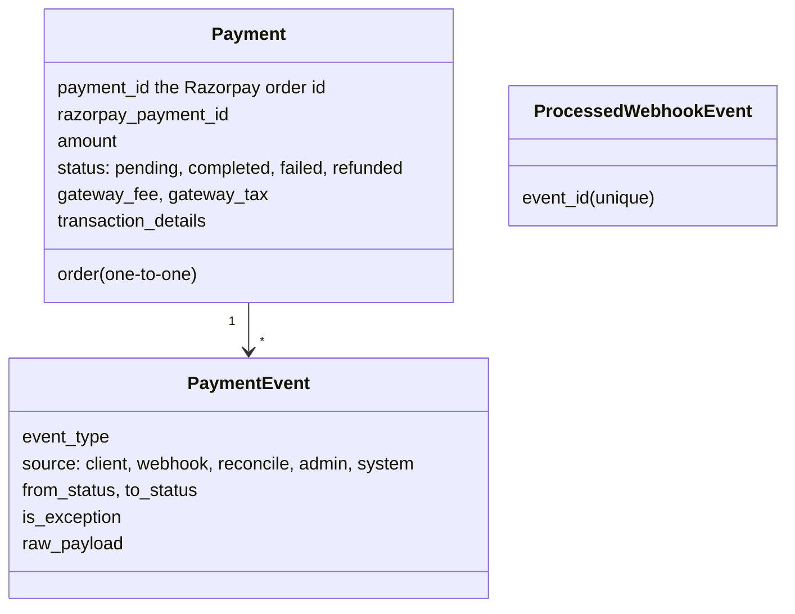

Three design points.

**1. One function changes payment state.** `mark_payment_captured` in
[payments/services.py](../Backend/payments/services.py) is called by the
browser's `/verify/`, by the webhook, and by the reconciler
([Part 1 §6.2](01_HLD.md)). Inside one transaction it:

1. Locks the `Order`, then the `Payment`. **Always in that order.** Every other
   code path that needs both locks takes them in the same order (the cancel
   action, the admin edit, the reconciler). If two paths locked in opposite
   orders they could each hold one lock and wait for the other forever. That is
   a **deadlock**, and a fixed lock order prevents it.
2. If the payment is already `completed` or `refunded`: do nothing except fill
   in details that arrived late (how they paid, the gateway's fee), and return.
3. If the amount in the message does not match the order: write an exception
   event, do not confirm.
4. If the order was already cancelled: record that money arrived, flag it for a
   refund, and **do not reopen the order**.
5. Otherwise: payment → `completed`; order → `paid` and `confirmed`; issue the
   invoice; empty the cart; write a `PaymentEvent`; queue the emails for after
   the commit.

**2. Every change writes an audit row.** `PaymentEvent` is written in the same
transaction as the change, so the history cannot disagree with the state. It
also records failures and oddities (`is_exception=True`) for the owner to look
at.

**3. A unique key stops a repeated message.** Razorpay puts an id on each
webhook delivery. `ProcessedWebhookEvent.event_id` is unique in the database. A
second insert of the same id fails. The code comment says it plainly: the
unique constraint, not the `exists()` check before it, is the real guard.

The webhook view itself, `razorpay_webhook` in
[payments/views.py](../Backend/payments/views.py), does four things in order:
refuse if no secret is configured; check the signature over the **raw bytes**
of the body (parsing and re-writing the JSON would change the bytes and break
the signature); parse; dispatch. It answers `200` for events it does not know,
so Razorpay does not keep retrying, and `500` only when our own processing
failed, so Razorpay *does* retry.

**Interview line:** "Payment state changes in exactly one function, under an
Order-then-Payment lock taken in the same order everywhere. It checks the
current state first, so a repeated webhook is harmless, and it writes an audit
row in the same transaction."

---

## 8. Documents: invoices, refunds, credit notes

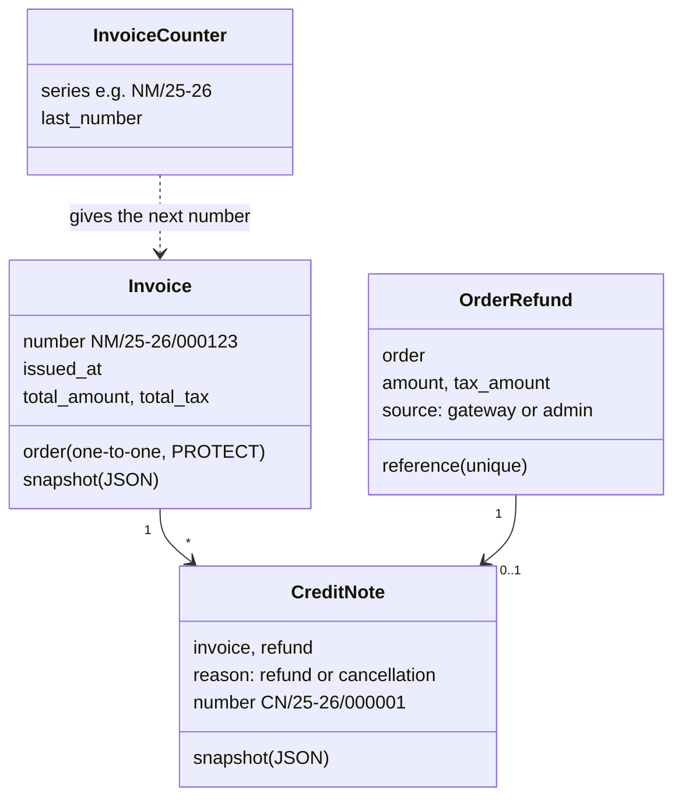

An invoice here is **a row in a table**, not a PDF made when someone clicks.
That one decision carries three rules. The module is
[orders/invoicing.py](../Backend/orders/invoicing.py).

### 8.1 The number is continuous

A GST invoice series must have no gaps within a financial year. Order ids
cannot be used, because every abandoned checkout and cancelled order uses one
up. So the number comes from `InvoiceCounter`:

```python
counter = InvoiceCounter.objects.select_for_update().get(pk=counter.pk)   # lock the row
counter.last_number += 1
counter.save(update_fields=['last_number', 'updated_at'])
return f"{series}/{counter.last_number:06d}", counter.last_number
```

The lock means two payments captured in the same instant cannot get the same
number. The series name includes the Indian financial year (April to March),
worked out in local time, so the count restarts each April.

### 8.2 It is issued when the sale becomes real

`invoice_is_due(order)` answers one question: did the supply happen? There are
two kinds of proof and either is enough.

| Proof | Meaning | Typical case |
|---|---|---|
| Money was received (`payment_status` is `paid` or `refunded`) | The sale is committed | Online order at capture; a ₹0 coupon order at placement |
| Goods went out (`status` is `shipped`, `delivering` or `delivered`) | The bill must travel with the parcel | Cash on delivery |

A cancelled order is never invoiced. An order that already has an invoice
never gets a second one.

### 8.3 It never changes after it is issued

`Invoice.snapshot` is a JSON copy of everything the PDF prints: seller details,
buyer details, lines, totals, tax. The PDF is drawn **only** from the snapshot.
Changing the shop's address in settings, or correcting a customer's address,
cannot alter a bill that was already given out.

`Order → Invoice` is `on_delete=PROTECT`: an order with an invoice cannot be
deleted. The nightly recycle-bin purge skips such orders.

### 8.4 Issuing must never break the thing that caused it

`maybe_issue_invoice` is called inside payment capture. If building the invoice
fails, should the payment be rolled back? No: the money has been taken. So the
function catches every error, logs it, and returns `None`. A separate command,
`backfill_invoices`, fills such gaps later.

There is a subtle part. In Postgres, once any statement fails inside a
transaction, the whole transaction is unusable. Catching the Python error is
not enough. So the function wraps its work in its own inner
`transaction.atomic()`, which creates a **savepoint**: a marker the database
can roll back to without losing the outer transaction.

### 8.5 Refunds are a ledger

A **ledger** is a list you only add to. Each `OrderRefund` row is one refund.
`Order.refunded_amount` is a running total kept for convenience, and it is
recomputed from the ledger each time, not added to.

All refunds go through one function, `record_refund` in
[orders/refunds.py](../Backend/orders/refunds.py). It locks the order, clamps
the amount to what is still refundable, works out the tax to reverse, writes
the row, updates the totals, returns the stock, and issues the credit note.

Refunds are dated by **when the refund happened**, not when the sale happened.
A refund in March must not change a January tax return that is already filed.

**Interview line:** "An invoice is an issued document, so it's a row: numbered
from a locked counter so the series has no gaps, issued at the business event
that makes the sale real, and frozen as a snapshot so nothing later can change
it. Corrections are a separate document, a credit note."

---

## 9. Giving stock back exactly once

Stock for an order can be returned by four different paths:

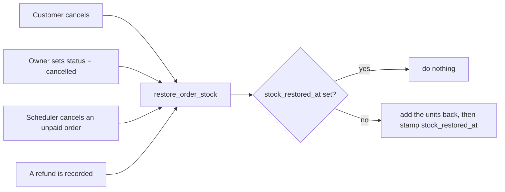

More than one can happen to the same order: the owner cancels a paid order and
then records the refund. Without a guard the same units would be added twice,
and the shop would show stock that does not exist.

The guard is one timestamp, `Order.stock_restored_at`. `restore_order_stock`
([orders/views.py](../Backend/orders/views.py)) checks it first and sets it
last. Every later call does nothing.

One more detail worth knowing. For a combo line, the function reads the
`OrderItemComponent` rows written at checkout, not the combo's recipe today.
If the owner changed the box's contents after the order, reading today's recipe
would return stock to sizes the order never took.

**Interview line:** "Four paths can restock an order, so the function is
idempotent: it stamps a timestamp the first time and is a no-op afterwards. And
it restores from the order's own snapshot, not from the live catalogue."

---

## 10. The assistant

The chat assistant is in [assistant/agent.py](../Backend/assistant/agent.py).
It is a loop with a hard limit.

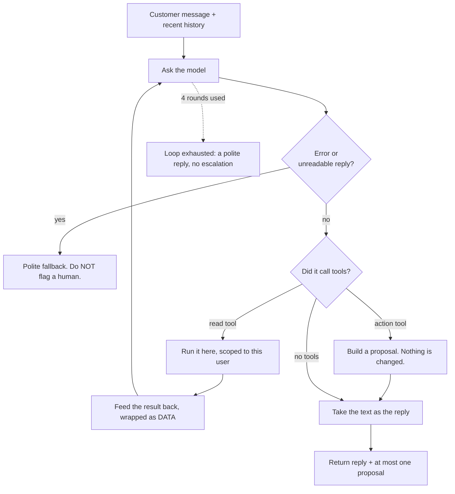

There are two kinds of tool, and the difference is the whole safety design.

| | Read tools | Action tools |
|---|---|---|
| Examples | `search_products`, `get_order_status`, `get_cart` | add to cart, edit cart, checkout, escalate to a human |
| What happens | The function runs on the server | A **proposal** is built and sent to the browser |
| Who decides | The code | The customer, by tapping confirm |
| Registry | `READ_TOOLS` | `ACTION_BUILDERS` |

Rules the loop keeps:

- **The model gets no database access.** It gets a list of named functions.
  Our code runs them.
- **Tools take the logged-in user as an argument** and filter by that user. If
  a customer tricks the model into asking for someone else's order, the tool
  still looks only among that customer's orders. The model's output is treated
  like any other untrusted input.
- **Tool results are wrapped in `<<DATA>>` markers** so text inside a product
  description is not read as an instruction.
- **At most 4 rounds** per message, **20 seconds** per model call, and a token
  budget for history. Old messages are dropped newest-kept-first when the
  budget is reached, and the customer is told.
- **Only the customer can call a human.** The result has a `reason`: `ok`,
  `llm_error`, `loop_exhausted`, `customer_asked`, `llm_unavailable`. Only
  `customer_asked` flags the conversation for the owner. A model failure is our
  problem, not a reason to page a person.
- **Text sent in the same round as a lookup is not the answer.** "Let me check
  that for you" was written before the result came back. The loop goes round
  again so the reply is written with the result.
- **The reply is cleaned.** HTML tags and any links the model wrote are removed.

The same class also runs the owner's assistant (`persona='admin'`), with a
different prompt, read-only reporting tools and no action tools.

**Interview line:** "The model is advisory. Read tools run on the server and
are scoped to the logged-in user; anything that changes state comes back as a
proposal the customer confirms. The loop is bounded by rounds, time and tokens,
and a model failure degrades to a polite reply instead of an error page."

---

## 11. Login, in one page

The full story is in [Backend/docs/AUTH.md](../Backend/docs/AUTH.md). The shape:

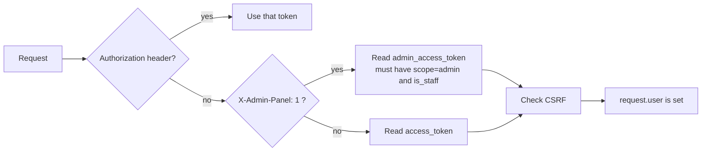

That is the whole of `CookieJWTAuthentication`
([users/authentication.py](../Backend/users/authentication.py)), a class of
about 30 lines that overrides one method of the library's class.

- The token is in an **HttpOnly cookie**. JavaScript on the page cannot read it.
- Because cookies are sent automatically, a cookie-based request must also pass
  the **CSRF** check. A request with a token in the header skips it, because a
  malicious site cannot make a browser add that header.
- The shop and the admin panel have **separate cookies**. A header tells the
  server which to read.
- An account must **verify its email** before it can log in. Verifying needs
  the code from the email *and* the password. The code proves the inbox; the
  password proves the person is the one who set it.
- Changing or resetting a password **cancels every refresh token** for that
  account, so other devices are logged out within 15 minutes.

---

## 12. The rules that must always hold

A design is defined by its **invariants**: things that are true no matter what
request arrives. Here they are with where each is enforced. The strongest are
enforced by the database; the weakest only by code.

| Rule | Enforced by |
|---|---|
| Variant stock is never negative | Database check constraint |
| A product has exactly one default variant | Database unique constraint |
| A cart line is a product *or* a combo, never both | Database check constraint |
| The same size is on at most one line of a cart | Database unique constraint |
| An order has at most one invoice | Database one-to-one |
| Invoice numbers in a series are unique and continuous | Unique constraint + locked counter |
| An order with an invoice cannot be deleted | `on_delete=PROTECT` |
| A product on any order cannot be deleted | `on_delete=PROTECT` |
| The same gateway refund is recorded once | Unique `reference` |
| The same webhook is processed once | Unique `event_id` |
| Two customers cannot both buy the last unit | Row lock + re-check in the transaction |
| A coupon is not used more than its limit | Row lock + re-check in the transaction |
| An order's stock is returned at most once | `stock_restored_at` |
| A payment is confirmed at most once | State check under a lock |
| The client cannot set a price | The create serializer has no price fields |
| A user sees only their own orders | `get_queryset` filters by user |
| An issued invoice never changes | The PDF reads only the snapshot |
| A refund needs money to have arrived | `_is_refundable_payment` |

When you are asked to "design X" in an interview, start by listing rules like
these. Then choose, for each, the strongest place that can enforce it.

**Interview line:** "I write down the invariants first, then push each one as
far down as it will go: a database constraint if possible, a lock and re-check
if it spans rows, and application code only when nothing stronger fits."

---

Next: [Part 3 — backend patterns](03_LLD_Backend_Patterns.md).
