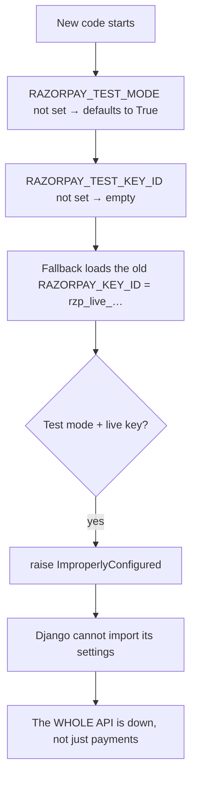

# 04 — A Boot Guard and the Whole API

> Source: `Backend/spices_backend/settings.py` (the Razorpay block),
> `Backend/payments/gateway.py`
> Toggle added and production migrated: 2026-07-20

---

## The feature

Razorpay gives two pairs of keys: **test** keys (no real money moves) and
**live** keys (real cards are charged). The project used to have one pair of
settings:

```env
RAZORPAY_KEY_ID=rzp_live_...
RAZORPAY_KEY_SECRET=...
```

Switching between test and live meant editing secrets by hand. A toggle was
added so both pairs can sit in the environment and one flag picks:

```python
RAZORPAY_TEST_MODE = config('RAZORPAY_TEST_MODE', default=True, cast=bool)

if RAZORPAY_TEST_MODE:
    RAZORPAY_KEY_ID = RAZORPAY_TEST_KEY_ID
else:
    RAZORPAY_KEY_ID = RAZORPAY_LIVE_KEY_ID
```

The rest of the code only ever reads `RAZORPAY_KEY_ID`. The choice is made in
one place.

---

## The guard

Mixing the flag and the keys is dangerous in both directions:

- Flag says *test*, key is *live* → a build that believes it is testing charges
  real cards.
- Flag says *live*, key is *test* → customers "pay", no money arrives.

So `settings.py` checks at start-up and refuses to run:

```python
if RAZORPAY_KEY_ID:
    _is_live_key = RAZORPAY_KEY_ID.startswith('rzp_live_')
    if RAZORPAY_TEST_MODE and _is_live_key:
        raise ImproperlyConfigured("RAZORPAY_TEST_MODE=True but the active key is a live key …")
    if not RAZORPAY_TEST_MODE and not _is_live_key:
        raise ImproperlyConfigured("RAZORPAY_TEST_MODE=False but the active key is not a live key …")
    if not RAZORPAY_TEST_MODE and DEBUG:
        raise ImproperlyConfigured("Refusing to run live Razorpay keys with DEBUG=True …")
```

This is called **failing fast**: a bad configuration stops the program the
moment it starts, before any customer is affected. It is the right design for a
mistake that costs real money.

---

## The trap inside the guard

Two reasonable decisions combine into something sharp.

**Decision 1: a safe default.** `RAZORPAY_TEST_MODE` defaults to `True`. If
someone forgets to set it, no real money moves. Sensible.

**Decision 2: a compatibility fallback.** To be kind to environments that have
not been updated yet, the code falls back to the old names:

```python
if not RAZORPAY_KEY_ID:
    RAZORPAY_KEY_ID = config('RAZORPAY_KEY_ID', default='')   # the old flat name
```

Now follow an environment that still has only the old names, holding a live
key:



The guard does its job perfectly. It was built to refuse this combination. But
`settings.py` is imported before anything else, so an exception there means
Django never starts. Browsing, login, the admin panel: all gone. A check about
payments takes out everything.

The fix for the rollout was to update the environment **before** the new code:
set `RAZORPAY_TEST_MODE=False` and fill in `RAZORPAY_LIVE_KEY_ID` and
`RAZORPAY_LIVE_KEY_SECRET`. That was done on production the same day.

---

## Was the guard a mistake?

No. Compare the two failures:

| | Without the guard | With the guard |
|---|---|---|
| What happens | Real cards charged by a test build, or orders "paid" with no money | The site does not start |
| Who notices | Nobody, until the bank statement | Everyone, immediately |
| How bad | Money and trust | A few minutes of downtime |

A loud failure at start-up beats a quiet wrong answer. The lesson is not
"remove the guard". It is: **a guard at start-up turns a config mistake into an
outage, so the rollout must be planned around it.**

Compare with [lesson 01](01_when_a_config_value_changes_meaning.md). There, a
leftover setting only produces a *warning*, because the app is already
behaving correctly. Here it is a *crash*, because the app would otherwise move
money wrongly. Same instinct, different cost, different answer.

---

## The general lesson

> **Before you ship a start-up check, run it in your head against every
> environment that exists today**, not only the one on your laptop.

A checklist for any change to configuration:

1. What does each existing environment currently hold?
2. With the new code and the *old* environment, what happens?
3. If the answer is "it refuses to start", the environment must be changed
   first, and that step belongs in the deploy notes.
4. Verify the result after deploying. This project has a one-line command that
   prints the mode and the first characters of the key, without printing any
   secret.

And a general point about defaults: a default that is safe in a fresh
environment can be wrong in an existing one. `True` was the safe default for
someone starting out. For the production server, which held a live key, it was
the one value guaranteed to trip the guard.

---

## Interview questions

1. *What is "fail fast" and when do you use it?*
   → Stop at start-up on a configuration that would do harm. Use it when
   running wrongly is worse than not running: payments, security settings.

2. *Your new validation makes the service refuse to start in production. Whose
   fault is it?*
   → The rollout's. The check is right. The plan forgot that the existing
   environment would fail it. Change the environment first.

3. *Why does a payment setting take down product browsing?*
   → The check runs while the settings module is imported. If that raises, the
   framework never starts, so nothing works.

4. *How could you limit the damage?*
   → Check at the point of use instead (when a payment starts), so only
   payments fail. The cost is that the problem is found later, by a customer.
   For live-key mistakes, start-up is still the better place.

5. *How do you check a deployed config without leaking secrets?*
   → Print only what is safe: the flag, the first few characters of the key,
   and whether a secret is set (true or false).
