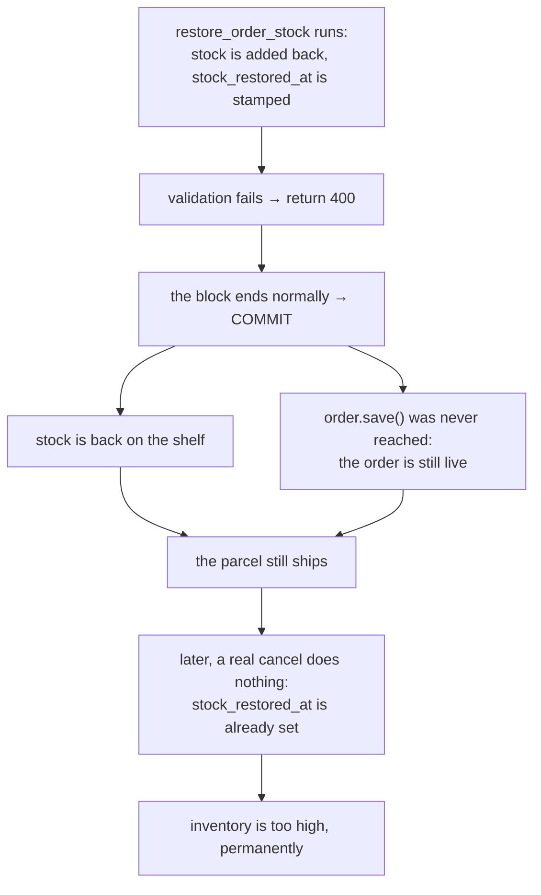

# 08 — `return` Inside a Transaction Commits

> Source: `Backend/orders/views.py::OrderViewSet.update` (the comments above the
> restock step and inside the refund branch),
> `Backend/orders/invoicing.py::maybe_issue_invoice`

---

## The rule most people get wrong

```python
with transaction.atomic():
    order.status = 'refunded'
    order.save()
    if something_is_wrong:
        return Response({'error': '...'}, status=400)     # ← what happens to the save?
```

Many people expect the save to be undone, because an error response was
returned. **It is not. The save is committed.**

`transaction.atomic()` is a context manager: it runs set-up when the `with`
block is entered and clean-up when it is left. Its clean-up has exactly two
cases:

| How the block ends | What the database does |
|---|---|
| An **exception** leaves the block | Roll back: undo everything |
| **Anything else** (the last line, `return`, `break`) | Commit: save everything |

A `return` is not an exception. Python does not know that a `Response` with
status 400 means "something went wrong". To Django, the block finished
normally.

So the status code the customer sees and what the database did can disagree:
the browser shows an error, and half the change was saved.

---

## Where this bites in real code

The admin order edit does several things inside one transaction. Two of them
are worth looking at closely.

### Case 1: stock returned, order still live

When the owner cancels an order, its stock goes back on the shelf:

```python
if cancelling:
    restore_order_stock(order)
    order.cancelled_at = timezone.now()

order.status = new_status
order.save()
```

Imagine a validation check placed *after* `restore_order_stock` that returns a
400. The sequence would be:



That is why the code carries this comment, in capitals:

> THIS MUST STAY BELOW EVERY `return Response(400)` ABOVE.

All the validation that can return a 400 happens **before** anything is
written. Several checks are even done before the transaction starts, with a
comment saying why: "a 400 from inside would commit earlier writes".

### Case 2: marked refunded, nothing in the ledger

Further down, the order has already been saved with `status='refunded'`. Then
the refund amount is checked. If nothing is left to refund, a plain 400 would
leave an order that says "refunded" on every screen with no refund behind it.

So this branch **raises** instead of returning:

```python
if outstanding <= 0:
    raise DRFValidationError({'error': 'This order has nothing left to refund …'})
```

`DRFValidationError` is an exception. It leaves the `with` block as an
exception, so everything is rolled back. Django REST Framework then turns it
into a 400 response. The customer sees the same error either way. The
difference is in the database.

---

## The two safe shapes

**Shape A: validate first, write last.** Do every check that can refuse before
the first write. Then nothing needs undoing.

```python
# all checks, no writes
if bad_input:
    return Response({...}, status=400)

with transaction.atomic():
    # only writes from here on
```

**Shape B: inside the block, refuse by raising.**

```python
with transaction.atomic():
    obj.save()
    if must_refuse:
        raise ValidationError({...})      # rolls back, still a 400
```

The order-creation code uses Shape B throughout: every failed check inside the
block raises `ValueError`, and one `except ValueError` outside the block turns
it into a 400. That is why a failed checkout never leaves a half-made order.

---

## The opposite problem: catching too much

There is a mirror-image trap. Suppose you *want* to continue after a failure:

```python
with transaction.atomic():
    take_payment()
    try:
        issue_invoice()          # a database error happens in here
    except Exception:
        pass                     # carry on
    send_more_queries()          # ← fails: "current transaction is aborted"
```

In Postgres, once a statement fails, the whole transaction is in a failed state
and refuses further work. Catching the Python exception does not fix the
database's state.

The fix is a **savepoint**: a nested `transaction.atomic()` around the risky
part. If it fails, the database rolls back to the savepoint and the outer
transaction is still usable.

```python
try:
    with transaction.atomic():           # a savepoint
        invoice, _ = issue_invoice(order, when=when)
    return invoice
except Exception:
    logger.exception("Failed to issue invoice for order %s", ...)
    return None
```

That is exactly `maybe_issue_invoice`. It is what lets a payment capture
succeed even if the invoice step breaks.

---

## The general lesson

> **A transaction commits unless an exception leaves the block.** The HTTP
> status you return has nothing to do with it.

Three habits that follow:

1. Validate before you write.
2. Inside a transaction, refuse by raising.
3. If you must swallow an error inside a transaction, wrap that part in its
   own `atomic()` so there is a savepoint to roll back to.

And when a rule about *order of lines* matters this much, write it in a comment
right there. The next person to add a check will add it in the wrong place
otherwise. The comment in `update()` is doing real work.

---

## Interview questions

1. *What happens if you `return` from inside `with transaction.atomic():`?*
   → The block ends without an exception, so it commits. Writes made before the
   return are saved.

2. *How do you roll back and still send a clean 400?*
   → Raise an exception the framework turns into a 400, such as a validation
   error. Or do all checks before the first write.

3. *What is a savepoint?*
   → A marker inside a transaction. The database can roll back to it without
   undoing the whole transaction. In Django, a nested `atomic()` creates one.

4. *You catch an exception inside a transaction and the next query fails with
   "current transaction is aborted". Why?*
   → Postgres marks the transaction as failed after an error. Use a savepoint
   around the part that may fail.

5. *Why does the order of statements matter in this function?*
   → Stock is returned before the order is saved. A return between the two
   would commit the stock change and not the order change. So every early
   return must come before the first write.
