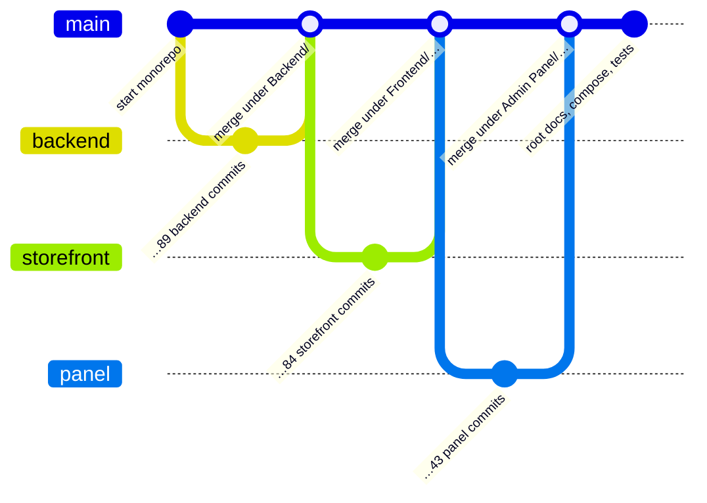

# 09 — One Repository From Three

> Source: the root `.git`, `.gitignore`, `.gitattributes`
> Done: 2026-10-02

---

## The situation

The project lived in one folder, but it was **three git repositories**:

| Folder | Its own repository |
|---|---|
| `Backend/` | `NGU_Backend` (89 commits) |
| `Frontend/nidhi-brand-forge/` | `nidhi-brand-forge` (84 commits) |
| `Admin Panel/e-commerce-command-center/` | `e-commerce-command-center` (43 commits) |

The root folder was not a repository at all. So the files that describe the
*whole* system were tracked nowhere: the Docker Compose files, the deployment
guide, the end-to-end tests, `CLAUDE.md`, the plans and audits.

It also meant one feature was three commits in three places. "Add a field to
the API, show it in the storefront, edit it in the panel" could not be one
change that is reviewed, reverted or found together.

---

## Two words: monorepo and polyrepo

- **Polyrepo:** one repository per part. Good when separate teams release
  separate parts on separate schedules.
- **Monorepo:** one repository for all parts. Good when the parts change
  together and are deployed together.

Here there is one developer, one deploy, and most features touch two or three
parts. A monorepo fits.

| | Three repos | One repo |
|---|---|---|
| A feature across backend and frontends | 3 commits, 3 pushes | 1 commit |
| "What was live on 2 October?" | 3 commit ids to remember | 1 commit id |
| Root docs, compose files, e2e tests | Not tracked | Tracked |
| History of each part | Kept | Kept (see below) |
| Giving someone access to only the frontend | Easy | Not possible |
| Clone size | Small each | Larger |

---

## The hard part: keeping the history

The simple way is to delete the three `.git` folders and commit everything as
one new commit. That throws away 216 commits: who changed what, when and why.

The way used here keeps all of it. For each of the three:

```bash
# 1. Copy the old repository's commits into the new one (no files change yet)
git fetch ./Backend main:refs/import/backend

# 2. Start a merge that joins the two histories but keeps our files as they are
git merge -s ours --no-commit --allow-unrelated-histories refs/import/backend

# 3. Put the old repository's files into the index under a folder prefix
git read-tree --prefix=Backend/ refs/import/backend

# 4. Commit the merge
git commit -m "Merge the backend history under Backend/"
```

What each step means:

- **`--allow-unrelated-histories`**: git normally refuses to merge two
  histories that share no first commit. This says it is intended.
- **`-s ours`**: the "ours" strategy records the merge without changing any
  file. It is only used to join the histories.
- **`read-tree --prefix=Backend/`**: reads the old repository's file tree into
  the **index** (the list of what the next commit contains), with every path
  placed under `Backend/`. In the old repository a file was `orders/views.py`.
  In the new one the same content is `Backend/orders/views.py`.

A commit is a snapshot of files plus pointers to its parent commits. The merge
commit has two parents: the new repository's previous commit, and the old
repository's last commit. Through that second parent, every old commit is
reachable.



One thing to know afterwards: the old commits still use the old paths. In them
the file is `orders/views.py`, not `Backend/orders/views.py`. So:

```bash
git log -- Backend/orders/views.py          # shows only the merge and what came after

# the file's whole history: give both paths and ask for the full history
git log --full-history -- orders/views.py Backend/orders/views.py

git blame Backend/orders/views.py           # works as normal, back to the first commit
```

`git blame` follows the content across the merge by itself. `git log` with a
path does not, unless you name the old path too.

---

## Three details that mattered

**1. Uncommitted work stayed uncommitted.** Nine files had local edits that
were not committed in the old repositories. Because step 3 loads the files from
the old *commit* and not from the disk, those nine files show up as "modified"
in the new repository, exactly as before. The merge did not quietly commit
unfinished work.

**2. The old `.git` folders were moved, not deleted.** Git will not track a
folder that contains its own `.git` as ordinary files. So the three were moved
to `.git-backup/` (which is ignored). They still hold the old branches, a
stash, and the links to three separate working folders. Those links were
repaired with `git worktree repair`.

**3. Secrets were checked before the first commit.** The root folder held
things that must never be committed: a server key (`.pem`), cloud access keys
(`.csv`), real environment files. The `.gitignore` was written first, then
`git add --dry-run` showed exactly which files would be added, and those files
were searched for key-shaped text. That search found a real sign-in client
secret and a cloud access key id typed into a deployment guide, and a test
account's password in a script. They were removed before anything was
committed.

The order matters. **Once a secret is in a commit it is in the history.**
Deleting the file in a later commit does not remove it. The only real fix is to
change the secret.

---

## What goes in `.gitignore`

A useful way to decide: a file belongs in the repository if someone cloning it
needs that file and could not rebuild it.

| Ignore | Why |
|---|---|
| Secrets: `.env*`, `*.pem`, access keys | Never. Keep `*.example` files with fake values instead. |
| Dependencies: `node_modules/`, `venv/` | Rebuilt from `package.json` / `requirements.txt` |
| Build output: `dist/`, `staticfiles/` | Rebuilt from source |
| Caches: `__pycache__/`, `.pytest_cache/` | Rebuilt automatically |
| Local databases and dumps | Data, not code; may hold customer data |
| Large binaries: videos, PDFs, screenshots | Make every clone slow; some show private data |
| Editor settings, OS files | Personal |

Each of the three folders kept its own `.gitignore` too. Git applies all of
them: a rule applies to the folder it is in and everything below it.

---

## The general lesson

> **The repository boundary should match how the code changes.** Things that
> change together belong together.

And two habits:

1. **Look before the first commit.** A dry run and a search for secrets take a
   minute. Removing a secret from history takes an afternoon and a new key.
2. **Move, don't delete, when you restructure.** The old `.git` folders cost
   nothing to keep, and make the whole change reversible.

---

## Interview questions

1. *Monorepo or polyrepo: how do you choose?*
   → By how the parts change and ship. Together → one repository. Separate
   teams and schedules → separate repositories.

2. *How do you merge two repositories and keep both histories?*
   → Fetch the second into the first. Merge with unrelated histories allowed.
   Place its files under a folder prefix with `read-tree --prefix` (or use
   `git subtree add`, which does the same thing in one command).

3. *What is the index in git?*
   → The list of file contents that will go into the next commit. `git add`
   writes to it. A commit is a saved copy of it.

4. *You committed a password by mistake. What do you do?*
   → Change the password first. Then, if needed, rewrite history to remove it.
   Deleting the file in a new commit is not enough.

5. *Why does `git log` on a file stop at the merge?*
   → Before the merge the file lived at a different path. Give `git log` both
   paths with `--full-history`. `git blame` still works on its own.
